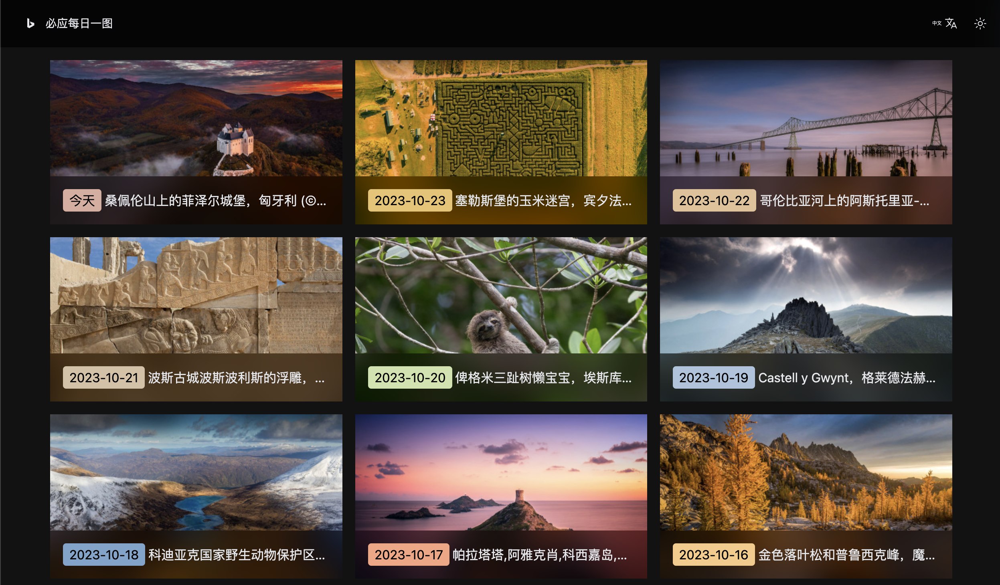

<div align="center">
    <h1>必应每日一图</h1>
    <p>每天更新一张图片（来源：必应）。诗曰：沉舟侧畔千帆过。一起来领略世界之美吧！</p>
    <p>DEMO（基于此仓库实时部署）: https://bing.mcloc.cn</p>
</div>


### 预览




### 特点

必应搜索每天会更新一张高质量的图片，用来做壁纸再好不过了，每天都有新心情。

这个项目有前后端，支持回溯，可以获取这几种处理后的图：缩略图、高斯模糊、灰度，同时有HD、UHD。

为了配合[Pmage](https://github.com/androidmumo/pmage)使用，接口还会返回base64格式的极小缩略图。

服务端还会提取图片的主要颜色，以使前端使用这些主要颜色渲染漂亮的页面。


## Docker部署

本项目提供了Docker版本。现在，您无需关注前后端如何部署。只需要简单的启动Docker镜像，即可拥有完全由您自己控制的服务。

docker镜像: https://hub.docker.com/r/androidmumo/bing

#### 部署步骤

1.参照以下模板在本地目录(如 `data`)中新建config.js文件

```
// 用户配置文件 config.js

// 基础配置
const baseConfig = {
  port: 3000, // 服务启动端口号 (默认为3000)
  updateTime: "00:01:00", // 每天更新时间 (开始从必应官方服务器下载图片的时间)
  DelayTime: 5, // 延迟时间（分钟） 即每天00:05：00的时候才显示当天的图片。性能较差的实例应适当调大此值 (仅针对'/api/getImage'接口)
  surviveDays: 90, // 图片存活天数（即图片保存多少天，到期即清理） 0为不清理
  retryTimeout: 10000, // 错误重试间隔 (单位:ms)
};

// 数据库配置 (注意：除数据库连接池大小外，以下配置项提及的内容需在安装前准备好并填入)
const databaseConfig = {
  host: "127.0.0.1", // 数据库链接地址
  port: "3306", // 数据库连接端口
  database: "bing", // 数据库名
  user: "bing", // 数据库用户名
  password: "bing", // 数据库密码
  connectionLimit: 100, // 数据库连接池大小
};

module.exports = {
  baseConfig,
  databaseConfig,
};

```

2.映射目录: 本地目录( `data` ) > 容器目录( `/usr/src/app/data` )

3.映射端口: 本地端口(如80) > 容器端口(默认为3000)

4.启动容器。


现在访问 `[您的服务器IP]:[您的本地端口]` 就可以看到前端页面了。

另外，您可能需要进行额外的服务器配置，如开放防火墙端口、开启反向代理等等。

要访问接口，请参考[服务端文档](./server/README.md)。

在容器启动时，程序会自动拉取当天图片并进行处理，这时您看到的页面可能是空的。别急，只要稍等片刻(依据您的服务器性能而定)，图片便会处理完毕，刷新页面即可看到当天图片。


### 其他文档

#### [服务端文档](./server/README.md)

#### [前端文档](./client/README.md)
